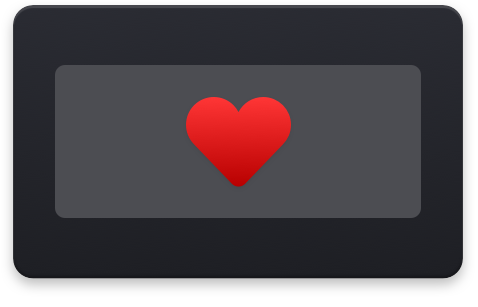
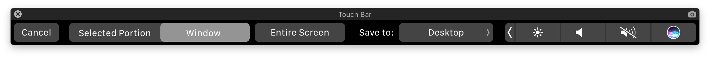

# Touch Bar Simulator [](https://github.com/sindresorhus/touch-bar-simulator/releases/latest)

> Use the Touch Bar on any Mac

Launch the Touch Bar simulator from anywhere without needing to have Xcode installed, whereas Apple requires you to launch it from inside Xcode. It also comes with a handy transparency slider and screenshot button.

**[Discuss it on Product Hunt](https://www.producthunt.com/posts/touch-bar-simulator)**



*Check out my other macOS app → [Battery Indicator](https://itunes.apple.com/no/app/battery-indicator/id1206020918?mt=12)*


## Getting started

#### [Download the latest release](https://github.com/sindresorhus/touch-bar-simulator/releases/latest)

---

Or install it with [Homebrew-Cask](https://caskroom.github.io):

```
$ brew update && brew cask install touch-bar-simulator
```


*Requires macOS 10.12.2 or later.*


## Screenshot

You can capture a screenshot of the Touch Bar by either:

1. Clicking the screenshot button in the Touch Bar window which saves it to `~/Desktop`.
2. Pressing <kbd>Command</kbd> <kbd>Shift</kbd> <kbd>6</kbd> which saves it to `~/Desktop`.
3. Pressing <kbd>Command</kbd> <kbd>Control</kbd> <kbd>Shift</kbd> <kbd>6</kbd> which saves it to the clipboard.


## FAQ

### How is this better than [TouchBarLauncher](https://github.com/zats/TouchBarLauncher)?

- Doesn't require Xcode
- Signed binary
- Transparency slider
- Screenshot button
- Doesn't steal focus when launched
- Doesn't take up space in the Dock or app switcher

### Why is this not on the App Store?

Apple would never allow it as it uses private APIs.

### How does this work?

In short, it exposes the Touch Bar simulator from inside Xcode as a standalone app with added features. I [class-dumped](https://github.com/nygard/class-dump) a private Xcode framework and used that to expose a private class to get a reference to the Touch Bar window controller. I then launch that window and add a screenshot button to it. I've bundled the required private frameworks to make it work without Xcode. That's why the binary is so big.


## Build

```
./build
```


## License

MIT © [Sindre Sorhus](https://sindresorhus.com)
