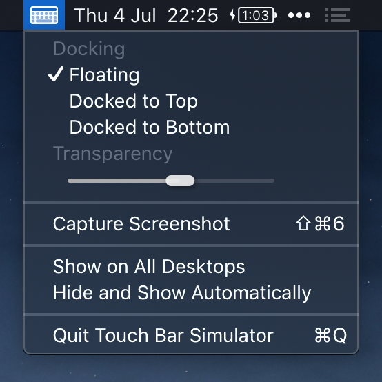

# Touch Bar Simulator [](https://github.com/sindresorhus/touch-bar-simulator/releases/latest)

> Use the Touch Bar on any Mac

Launch the Touch Bar simulator from anywhere without needing to have Xcode installed, whereas Apple requires you to launch it from inside Xcode. It also comes with a handy transparency slider, a screenshot button, and a menu bar icon and system service to toggle the Touch Bar with a click or keyboard shortcut.



Clicking the menu bar icon toggles the Touch Bar window.

Right-clicking or option-clicking the menu bar icon displays a menu with options to dock the window to the top or bottom of the screen, make it show on all desktops at once, access toolbar features in docked mode, or quit the app.

You can add a toggle shortcut in `System Preferences` → `Keyboard` → `Shortcuts` → `Services` → `Toggle Touch Bar`.

**Important:** If clicking in the simulator or the screenshot button is not working, you need to go to "System Preferences" → "Security & Privacy" → "Accessibility", and ensure "Touch Bar Simulator.app" is checked. If it's already checked, try unchecking and checking it again.


## Getting started

#### [Download the latest release](https://sindresorhus.com/touch-bar-simulator)

Or install it with [Homebrew-Cask](https://caskroom.github.io):

```
$ brew cask install touch-bar-simulator
```


*Requires macOS 10.14 or later.*


## Screenshot

You can capture a screenshot of the Touch Bar by either:

1. Clicking the screenshot button in the Touch Bar window or options menu which saves it to `~/Desktop`.
2. Pressing <kbd>⇧⌘6</kbd> which saves it to `~/Desktop`.
3. Pressing <kbd>⌃⇧⌘6</kbd> which saves it to the clipboard.


## FAQ

### Why is this not on the App Store?

Apple would never allow it as it uses private APIs.

### How does this work?

~~In short, it exposes the Touch Bar simulator from inside Xcode as a standalone app with added features. I [class-dumped](https://github.com/nygard/class-dump) a private Xcode framework and used that to expose a private class to get a reference to the Touch Bar window controller. I then launch that window and add a screenshot button to it. I've bundled the required private frameworks to make it work without Xcode. That's why the binary is so big.~~

Xcode 10 moved the required private symbols needed to trigger the Touch Bar simulator into the main IDEKit framework, which has a lot of dependencies on its own. I managed to get it working by including all those frameworks, but the app ended up being 700 MB... I then went back to the drawing board. I discovered a way to communicate with the Touch Bar simulator directly. The result of this is a faster and more stable app.


## Build

```
./build
```


## Related

- [Website](https://sindresorhus.com/touch-bar-simulator/)
- [Product Hunt submission](https://www.producthunt.com/posts/touch-bar-simulator)
- [Gifski](https://github.com/sindresorhus/gifski-app) - Convert videos to high-quality GIFs on your Mac
- [More apps…](https://sindresorhus.com/#apps)


## Maintainers

- [Sindre Sorhus](https://github.com/sindresorhus)
- [@ThatsJustCheesy](https://github.com/ThatsJustCheesy)


## License

MIT
