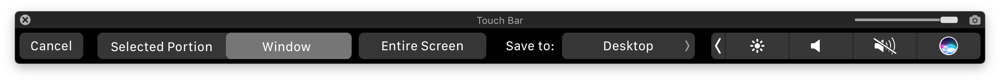

# Touch Bar Simulator

> Launch the Touch Bar simulator from anywhere without Xcode

Whereas Apple requires you to launch it from inside Xcode.

This app also comes with a handy screenshot button.

*Check out my other macOS app → [Battery Indicator](https://itunes.apple.com/no/app/battery-indicator/id1206020918?mt=12)*

## Download

[Download](https://github.com/sindresorhus/touch-bar-simulator/releases/latest) the latest release, unzip it, and move it to `/Applications`.

*Requires macOS 10.12.2 or later.*

## Screenshot

1. Click the screenshot button in the Touch Bar window to save to `~/Desktop`.
2. Press <kbd>Command</kbd> <kbd>Shift</kbd> <kbd>6</kbd> to save to `~/Desktop`.
2. Press <kbd>Command</kbd> <kbd>Control</kbd> <kbd>Shift</kbd> <kbd>6</kbd> to save to clipboard.

## FAQ

### How is this better than [TouchBarLauncher](https://github.com/zats/TouchBarLauncher)?

- Doesn't require Xcode
- Signed binary
- Screenshot button
- Doesn't steal focus when launched
- Doesn't take up space in the Dock or app switcher

## License

MIT © [Sindre Sorhus](https://sindresorhus.com)
